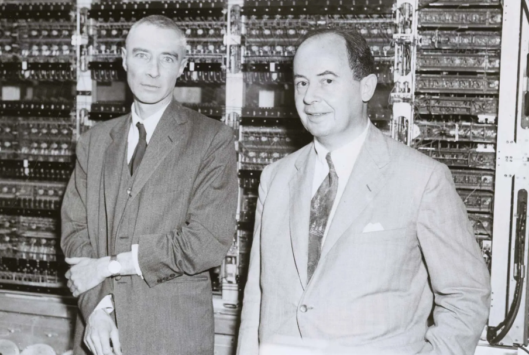
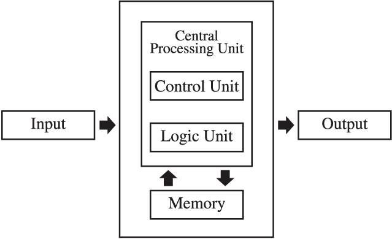

<p align="center">
  
  
  
  
</p>

<p align="center">
  
</p>

# 🐍 python101
## Professor, Dr. Vinícius Costa Amador 
### ✨ Bem-vindo! Este material foi preparado com carinho para receber você no curso de Python para o ciclo básico de programação. Espero que aproveite e que ele ajude no seu crescimento! 
---
### 📍 Sobre o Curso
Aqui está documentado um curso de Python do **básico ao avançado**, chamado **“python101”**.  
**Fortemente inspirado** no curso [Python for Everybody (PY4E)](https://www.py4e.com/), desenvolvido pela Universidade de Michigan e ministrado pelo Professor **Charles Severance**, e também inspirado pela Profa. Dra. **Raquel C. de Melo-Minardi**, do Departamento de Ciência da Computação da UFMG.  

> Referências adicionais podem ser encontradas em: [w3schools.com/python](https://www.w3schools.com/python/default.asp).  
Para estudantes de língua portuguesa, recomendamos a [Comunidade Python Brasil](https://python.org.br/), que promove aprendizado e colaboração.
---
# *📘Módulo 1: Conceitos elementares e a Programação Sequencial - 0.0 Nivelamento de Conceitos*
Navegue pelos diretórios do curso!! 📍
```
python101/
    └──Módulo 1/
          ├── 0.0. -Nivelamento de Conceitos (📍Você está aqui)/
          |           ├── 0.1. Pensamento Computacional
          |           ├── 0.2. Máquina de Von Neumann
          |           ├── 0.3. Linguagens de Programação
          |           └── 0.4. Linguagem Compilada x Interpretada
          ├── 1.0.0. -Sintaxe Básica/
          ├── 1.1.0.-Variáveis/
          ├── 1.2.0.-Operadores/
          ├── 1.3.0.-Expressões/
          ├── 1.4.0.-Entrada e Saída/
          └── 1.5.0.-Exercícios/
```
## 0.0. - **Nivelamento de Conceitos**
---

Este módulo apresenta os fundamentos teóricos que servem de base para o estudo da programação.
## 📌 0.1. Pensamento Computacional
O pensamento computacional é a habilidade de resolver problemas de forma sistemática, estruturada e eficiente, semelhante à forma como os computadores processam informações. 
#### Ele é composto por quatro pilares principais:
- **Decomposição** – dividir um problema complexo em `partes menores` e mais fáceis de resolver.
- **Reconhecimento de Padrões** – identificar `semelhanças ou repetições` que ajudam a simplificar o problema.
- **Abstração** – focar apenas nos `aspectos essenciais`, ignorando detalhes desnecessários.
- **Algoritmos** – criar uma `sequência de passos ordenados, finitos e não ambiguos para resolver o problema`.

> 🔎 Exemplos do Cotidiano
> #### Organizar um lanche
> - Decomposição: separar ingredientes (pão, queijo, presunto).
> - Algoritmo: 1. Cortar o pão → 2. Colocar queijo → 3. Adicionar presunto → 4. Fechar o pão.
> #### Calcular troco em uma compra
> - Decomposição: identificar valor pago e valor da compra.
> - Algoritmo: Subtrair → decidir quantidade de cédulas/moedas.
Essas ideias são a base da lógica que usaremos em programação.
>   

## 📌 0.2. Máquina de Von Neumann
A arquitetura de `Von Neumann`, um renomado cientista que trabalhou no famoso `projeto Manhatan`, consistiu de uma estrutura clássica dos computadores modernos.

<p align="center">
  
</p>

<p align="center">
Figura1. Von Neumann (direita) no projeto Manhatan ao lado de J Robert Oppenheimer.
</p>

O princípio da máquina é ilustrado à seguir:

#### Ela é formada por três etapas fundamentais:
- **Entrada** – dados que `entram no sistema` (teclado, mouse, sensores, arquivos).
- **Processamento** – a `CPU interpreta e processa as instruções`.
- **Saída** – o `resultado` exibido para o usuário (tela, impressora, som, etc.).

<p align="center">
  
</p>
<p align="center">
Figura2. Ilustração da arquitetura proposta por Von Neumann.
</p>

## 📌 Esquema Simplificado:
`Entrada  →  Processamento  →  Saída`
```python
💻 Exemplo em Python
# Entrada
nome = input("Digite seu nome: ")
# Processamento
mensagem = f"Olá, {nome}! Bem-vindo ao curso."
# Saída
print(mensagem)
```

>➡️ O usuário digita (entrada), o computador organiza a informação (processamento) e mostra o resultado (saída).


## 📌 0.3. Linguagens de Programação

Uma linguagem de programação é um `conjunto de regras` que permite que seres humanos `escrevam instruções` compreensíveis pelo computador.

#### 🔎 Por que existem?
Para `traduzir o raciocínio humano` em instruções que o `computador consiga executar`.
Para resolver problemas de forma `automatizada`.
#### 📖 Breve Histórico
- **Assembly (baixo nível)** – linguagem próxima do código de máquina.
- **C (1972)** – trouxe portabilidade e ainda é a base de muitos sistemas.
- **Python (1991)** – linguagem de alto nível, simples e legível.
- **Java (1995)** – orientada a objetos, amplamente usada em sistemas corporativos.

> As linguagens de programação podem ser classificadas em diferentes níveis de abstração em relação à máquina.

#### 🔽 Linguagens de Baixo Nível

Ficam mais `próximas do hardware`.
Exigem que o programador conheça detalhes da arquitetura (registradores, endereços de memória, instruções da CPU).
São rápidas, mas difíceis de aprender e manter.

**Exemplos:**
- **Linguagem de Máquina:** sequência de `0s e 1s` (binário) que o processador entende diretamente.
- **Assembly:** utiliza mnemônicos para instruções, como `MOV AX`, `1` (mover valor 1 para o registrador AX).

>📌 **Aplicações:**
Sistemas embarcados.
Drivers de dispositivos.
Programos que precisam de desempenho máximo (ex.: SO, controladores).

#### 🔼 Linguagens de Alto Nível

Ficam mais próximas da `linguagem humana`.
Mais fáceis de aprender, escrever e manter.
São traduzidas para linguagem de máquina por compiladores ou interpretadores.

**Exemplos:**
`Python, Java, C++, JavaScript`

>**📌 Aplicações:**
Desenvolvimento web, apps, ciência de dados, automação, IA, etc.

**Comparação**
| Aspecto       | Baixo Nível            | Alto Nível                        |
| ------------- | ---------------------- | --------------------------------- |
| Abstração     | Próximo ao hardware    | Próximo ao ser humano             |
| Facilidade    | Difícil, verboso       | Mais simples, legível             |
| Portabilidade | Baixa (depende da CPU) | Alta (roda em várias plataformas) |
| Exemplo       | Assembly               | Python, Java                      |

💻 Exemplo prático

🔹 Assembly (baixo nível):
```assembly
MOV AX, 5   ; move o valor 5 para o registrador AX
ADD AX, 3   ; soma 3 ao valor em AX
```

🔹 Python (alto nível):
```python
x = 5
x = x + 3
print(x)   # 8
```
## ⚙️ 0.4  Linguagem Compilada x Interpretada
##### Compiladas `(C, C++)`: precisam ser traduzidas para código de máquina antes de executar.
- ✅ Mais rápidas
- ❌ Processo de compilação mais demorado
##### Interpretadas `(Python, JavaScript)`: são lidas e executadas linha a linha por um interpretador.
- ✅ Mais fáceis de testar e depurar
- ❌ Geralmente mais lentas
- ✅ Resumo do Módulo 0

> - Pensamento Computacional: decomposição, padrões, abstração e algoritmos.
> - Máquina de Von Neumann: `entrada → processamento → saída`.
> - Linguagens de Programação: histórico, por que existem e diferença entre compiladas e interpretadas.
---