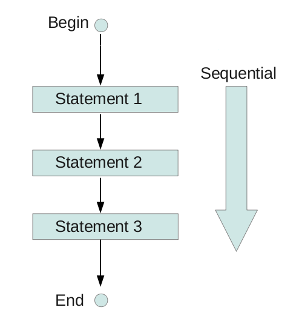

<p align="center">
  
  
  
  
</p>

<p align="center">
  
</p>

# 🐍 python101
## Professor, Dr. Vinícius Costa Amador 
### ✨ Bem-vindo! Este material foi preparado com carinho para receber você no curso de Python para o ciclo básico de programação. Espero que aproveite e que ele ajude no seu crescimento! 
---
### 📍 Sobre o Curso
Aqui está documentado um curso de Python do **básico ao avançado**, chamado **“python101”**.  
**Fortemente inspirado** no curso [Python for Everybody (PY4E)](https://www.py4e.com/), desenvolvido pela Universidade de Michigan e ministrado pelo Professor **Charles Severance**, e também inspirado pela Profa. Dra. **Raquel C. de Melo-Minardi**, do Departamento de Ciência da Computação da UFMG.  

> Referências adicionais podem ser encontradas em: [w3schools.com/python](https://www.w3schools.com/python/default.asp).  
Para estudantes de língua portuguesa, recomendamos a [Comunidade Python Brasil](https://python.org.br/), que promove aprendizado e colaboração.
---
# *📘Módulo 1: Conceitos elementares e a Programação Sequencial - 5.0 Programação Sequencial e Entrada/Saída*
Navegue pelos diretórios do curso!! 📍
```
python101/
    └──Módulo 1/
          ├── 0.0-Nivelamento de Conceitos/
          ├── 1.0-Sintaxe Básica/
          ├── 2.0-Variáveis/
          ├── 3.0-Operadores/
          ├── 4.0-Expressões (📍Você está aqui)/
          ├── 5.0-Entrada e Saída/
          │     ├── 5.1 – Programação Sequencial e Entrada/Saída/
          │     ├── 5.2 - Entrada com `input()`/
          │     └── 5.3 - Saída com `print()`/          
          └── 6.0-Exercícioss/
```

## 🐍 5.1 – Programação Sequencial e Entrada/Saída
A programação sequencial é o modelo mais básico de execução:

- **Entrada** → receber dados do usuário.
- **Processamento** → aplicar operações lógicas ou matemáticas.
- **Saída** → mostrar o resultado.

<p align="center">
  
</p>

Figura1. Esquematização do Fluxo Sequencial

> 👉 Esse ciclo Entrada → Processamento → Saída é a essência de como computadores funcionam.

## 5.2 📥 Entrada com `input()`
A função `input()` sempre retorna uma `string (str)`, mesmo que o usuário digite números.
```python
nome = input("Digite seu nome: ")
idade = input("Digite sua idade: ")  # ainda é string!
```
> ⚠️ Se quiser realizar cálculos, é necessário converter o tipo imediatamente:

```python
idade = int(input("Digite sua idade: "))
altura = float(input("Digite sua altura em metros: "))
```

## 5.3 📤 Saída com `print()`

A função `print()` exibe informações na tela. Pode receber múltiplos argumentos, separados por vírgula.
```python
print("Olá", nome, "você tem", idade, "anos.")
print(f"Olá {nome}, você tem {idade} anos.")  # f-string
```

### ✅ Exemplo Completo
```python
name   = input("Name: ")
age    = int(input("Age: "))            # cast to int
height = float(input("Height (m): "))    # cast to float
print(f"Hi, I'm {name}.")
print(f"I'm {age} years old and {height:.2f} m tall.")
```
---
### ❌ Erros comuns
```python
height = float(input("Height: "))
print("Recorded height: " + height)   # TypeError → height is float, needs str
```
**Correção**
```python
print("Recorded height: " + str(height))
# or, better
print(f"Recorded height: {height}")
```